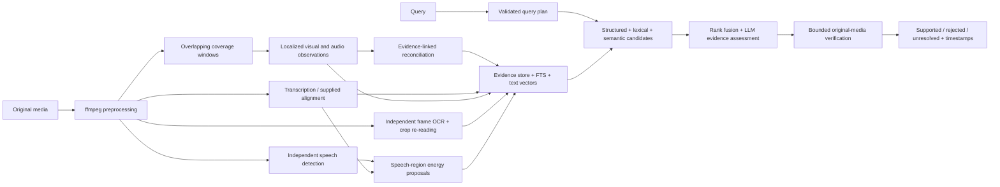

# Video Moment Retrieval

Search a video library by natural language and return localized, evidence-backed candidates or model-supported matches. Corpus-wide interpretation runs during ingestion; query-time media inspection is restricted to a configurable shortlist.

The implementation uses Python's standard library, SQLite FTS5, and ffmpeg. OpenRouter supplies replaceable model adapters. No vector database or GPU is required for the core application. Live audio analysis uses the small WebRTC VAD dependency; WhisperX alignment is an optional heavier adapter.

**Validation status:** automated contract/integration tests and a clearly labeled synthetic demo are included. Local decoding, audio extraction, frame extraction, and clip generation were smoke-tested on three supplied body-camera videos. Real model accuracy has **not** yet been measured; an API key and manually reviewed labels are required. Synthetic scores are not evidence of video-understanding quality.

## Quick start without an API key

Requires Python 3.11+ and ffmpeg/ffprobe on `PATH`. Run from the repository root:

```bash
python3 -m venv .venv
source .venv/bin/activate
python -m pip install -e ".[speech]"
python -m unittest discover -v
python -m video_moment_retrieval --data-dir data/demo demo
python3 -m video_moment_retrieval --data-dir data/demo --demo search \
  "Find the person in a red shirt raising their voice" --verify-budget 11
python3 -m video_moment_retrieval --data-dir data/demo --demo evaluate \
  data/demo/demo-labels.json --output reports/demo-evaluation.json
```

The demo contains authored scenarios, toy hashed embeddings with a small synonym map, and a scripted verifier. It tests wrong-person conjunctions, already-handcuffed states, discussion versus recitation, sirens, unreadable plates, and no-match behavior. It never claims to have analyzed real video. Synthetic and live indexes cannot be mixed.

The install above also provides `video-moment-retrieval`. The synthetic demo and most unit tests can run with system Python without extras; the native VAD test requires the speech extra.

## Index actual footage

Copy `.env.example` to `.env` and put the provided key there. `.env`, videos, derived media, databases, and reports are gitignored. Alternatively export `OPENROUTER_API_KEY`. The CLI reads `.env` without executing shell syntax; existing environment values take precedence. Use `--env-file /path/to/config` for a different file.

Models can be selected independently using `VIDEO_MOMENT_RETRIEVAL_VIDEO_MODEL`, `VIDEO_MOMENT_RETRIEVAL_AUDIO_MODEL`, `VIDEO_MOMENT_RETRIEVAL_TEXT_MODEL`, and `VIDEO_MOMENT_RETRIEVAL_EMBEDDING_MODEL`. Defaults are Gemini 2.5 Flash for reasoning/transcription and `openai/text-embedding-3-small` via OpenRouter for embeddings. Model availability and routing must be validated against your account. Changing the embedding model requires rebuilding in a separate data directory.

Existing `VIDEO_SEARCH_*` model settings remain supported as aliases; the `VIDEO_MOMENT_RETRIEVAL_*` settings take precedence when both are set.

Start with a short, explicitly bounded ingestion:

```bash
python3 -m video_moment_retrieval --data-dir data/live --max-requests 30 index \
  data/videos/video_29.mp4 --max-seconds 60 --skip-ocr
python3 -m video_moment_retrieval --data-dir data/live coverage
python3 -m video_moment_retrieval --data-dir data/live search \
  "Find moments where someone is being handcuffed" --verify-budget 5
```

Then index the selected videos fully, enabling OCR:

```bash
python3 -m video_moment_retrieval --data-dir data/live --max-requests 300 index \
  data/videos/video_29.mp4 --ocr-every 10
```

`--max-requests` limits HTTP attempts, including retries, for that command. It is not a dollar cap. Reported provider cost and token usage appear in JSON output; absent cost information is marked incomplete. Retried requests can incur charges. Start small and review usage before indexing more. Ingestion reserves attempts for later stages: weights are 25 for transcription, 35 for visual extraction, 5 for reconciliation, 25 for OCR, and 10 for embeddings, normalized over enabled stages sharing a client. At least one remaining attempt is reserved for embeddings; unused allocations carry forward. These are request reservations, not completion guarantees or dollar caps. The index report includes the allocation. Operational errors produce exit code 2; rerunning reuses successful artifacts.

Ingestion builds a separate staging database and publishes the searchable records, vectors, and coverage atomically. A failed or interrupted reindex preserves the previously published snapshot. A first ingestion with stage failures may publish a clearly reported partial index. `publication`, `attempt_report`, and `attempt_coverage` describe the outcome; `coverage` lists recent attempt paths, including interrupted work. Staging databases and attempt reports are retained under `index-attempts/` for inspection. Each attempt also writes its own `observations.json` and `index-report.json`; the published video metadata selects these files through `artifacts` in the same transaction as its records. Failed or interrupted reruns cannot overwrite the selected reports. Older shared sidecars are historical; use the metadata paths for current reports. A successful index invocation replaces that video's searchable snapshot with the requested range/configuration. A later `--max-seconds` run therefore narrows an existing full index intentionally; use a separate data directory for experiments. Original media remains unchanged. Keep original paths available for verification.

### Download script

The downloader parses the company's script as data and never executes it. Duplicate output filenames (including case collisions) are rejected. Downloads are checked against the response length when supplied and probed for a video stream before publication. Existing files are reused only when a saved transfer receipt matches the source and the file's size and SHA-256; files without receipts are downloaded again. Signed URLs are not printed or stored in the index or receipt:

```bash
python3 -m video_moment_retrieval download /path/to/download-videos.sh --list
python3 -m video_moment_retrieval download /path/to/download-videos.sh \
  --videos video_29.mp4 video_26.mp4 video_18.mp4 --output-dir data/videos
```

URLs expire; generate a fresh script when necessary. The script itself should not be committed.

## Architecture



### Offline evidence

- **Coverage windows and events coexist.** Missing an event record does not remove its parent interval from retrieval. Defaults: 20-second windows, 5-second overlap.
- **Time coordinates are explicit.** Every stored timestamp is in seconds from the original media start. Clip-relative model outputs are validated and offset before storage. Extracted WAVs preserve delayed audio with timestamp-based silence padding. Invalid/out-of-bounds intervals fail their stage.
- **Transcription is replaceable.** The default audio-model adapter yields estimated segment timestamps, not forced alignment or reliable diarization. Use `--asr whisperx` for a full-track local ASR + forced-word-alignment pass, optionally `--diarize` with an authorized `HF_TOKEN`. Install `.[alignment]` in a WhisperX-compatible Python environment first; the adapter contract is tested, but local WhisperX model inference has not been run here. Alternatively pass `--transcript aligned.json` to use independently aligned original-timeline segments. The format is a list of `{ "start": 0.5, "end": 2.0, "text": "...", "speaker": null }`. WhisperX output's `segments` list can be exported into this format after review.
- **Audio measurements are proposals.** WebRTC VAD identifies speech independently of ASR. Diarization boundaries subdivide detected speech, leaving overlaps and unknown speakers unresolved. RMS changes in dBFS use the last five seconds of the same speaker's detected speech where labels are available. Unknown speakers share an explicitly unresolved baseline; interleaved voices can weaken these candidates. They never establish shouting. The VLM extraction provides an additional audio-observation route; final prosody verification receives actual audio.
- **OCR has an independent route.** Original-resolution frames are sampled independently of event extraction. Nine frames are inspected per sampling window: three nearby frames around each of 20%, 50%, and 80% of its duration. The spread reduces temporal blind spots while nearby alternatives help with blur. This increases image input compared with three frames, although detection still uses one request per window; it remains sparse sampling and can miss brief text. The sampling policy is part of the cache key. Blur is measured on the actual crops, which are read in sharpness order. All detected regions remain eligible, avoiding a whole-frame blur heuristic that could discard a sharp plate. Partial/unreadable text is retained. Conflicting per-frame readings stay separate. At most 20 detections per sampling window are accepted; larger responses are marked failed rather than silently truncated.
- **People and roles are explicit.** Observations have subject, actor, recipient, and speaker fields. Visual IDs remain local to extraction windows; the system populates explicit speaker/person links and cross-window continuity hypotheses, persisted in a relational table. Relationship records require status, interval, and valid evidence references. Temporal overlap cannot create a supported speaker/person link. Named-person linking and validated persistent tracking remain deferred. A media verifier can support a same-person relation only with affirmative evidence in the inspected media.
- **Reconciliation is conservative.** Extraction receives a bounded recap of the previous window, used only as context. A separate LLM pass proposes evidence-linked continuations between neighboring windows, even when descriptions differ. These description-based links remain hypotheses and do not collapse uncertain identities. Failed windows reset the recap and cannot be silently bridged. Coverage is recorded for actual neighboring-window tasks; a skipped task is never overwritten by a whole-video completion marker. Use `--no-rolling-context` and `--no-reconciliation` for ablations.
- **Cache dependencies are content-aware.** Source hash, model/prompt/schema versions, input ranges/settings, and upstream transcript contents determine stage keys. Verification keys include query, observations, nearby context, and media settings. Failed computations are not cached as successes.

`--fps` controls the uploaded clip's frame rate, not the provider's internal sampling rate. Do not claim that encoding at 8 FPS forces a model to inspect 8 FPS. Evaluate sampling/routing choices on fast-action examples.

### Retrieval and decisions

Structured, lexical, and semantic retrieval run concurrently on separate read-only SQLite connections. There is no conditional fallback gate. A failed channel is reported without suppressing the others; embedding failure at ingestion likewise leaves lexical/structured evidence searchable. Structured fields generate candidate unions, not hard exclusions based on uncertain attributes. FTS handles lexical overlap; embeddings provide semantic generalization. Reciprocal rank fusion combines ranks without treating different score scales as comparable probabilities.

All policies use the same post-merge candidate budget. Broad windows remain searchable rather than being swallowed by short observations. A bounded, cached LLM assessment pass evaluates the entire query against subject-scoped observations and relationships before media verification. It reorders candidates without discarding unknowns. Unproved speaker/person bindings cannot be ranked as supported by the index. Use `--no-assessment` to measure the rank-fusion baseline.

Default search verifies up to five candidates. A supported match inside a truncated inspection is valid only for its returned interval. `partial_inspection` exposes incomplete coverage at the response level; each result distinguishes `clip_inspection_complete` from `inspection_complete` for the whole candidate. Use enumeration to inspect long-record tails. It bounds clip duration, height, frame rate, encoded payload size, output tokens, HTTP attempts, retries, and per-request timeout. Long records in enumeration are divided into overlapping-context inspection slices that collectively cover their full interval. A verifier may return multiple distinct matches from each slice, with an explicit completeness flag. Audio questions receive WAV audio explicitly. OCR questions receive original-resolution frames. Supported answers must provide a localized interval and valid evidence for every planned criterion and required modality. Malformed output or provider failure produces `unresolved`, never an accepted match. Validation also applies to cached verdicts and every verifier adapter; same-person matches use a typed binding: `visual` requires visual tracking of the same person, while `speaker_visual` requires synchronized visual/audio evidence and a speaker. Nested evidence references must identify supplied media. OCR results require a normalized bounding box and a cited `frame_id` whose timestamp is inside the returned interval. `supported` is a model assessment, not a calibrated probability or human certification.

```bash
# Fast candidate preview: every result is explicitly labeled candidate.
python3 -m video_moment_retrieval --data-dir data/live search "red shirt" --unverified

# Enumerate indexed evidence in bounded pages.
python3 -m video_moment_retrieval --data-dir data/live search "Find every raised voice" \
  --all --verify-budget 5
```

Use the returned `pagination.next_offset` and `pagination.snapshot` with `--offset` and `--snapshot` for the next page. A snapshot is mandatory for every nonzero offset, including ranked search. Offsets count bounded inspection tasks, including rejected/unresolved tasks; one long record can create several tasks. Snapshot changes reject stale pagination, including changes to inspection geometry. Ranked search recomputes ordering; use enumeration for a frozen queue across pages. Enumeration freezes a lightweight task queue on the first page. Continuations load only page records/context and reuse the retrieval ordering; the index revision and source state reject stale queues. The queue and accumulated state are still read from JSON, so state-file I/O grows with job size. Enumeration state prevents skipped pages and deduplicates matches across pages; `accumulated_results` exposes the combined result set. Multiple plates with different readings remain distinct. `all_tasks_verified` is false when inspections are unresolved or declared incomplete. This says nothing about events missed during extraction or between sampled OCR frames.

Output includes `outcome` (`complete`, `degraded`, or `failed`), a separate `decision`, explicit `operational_errors`, candidates, inspected verdicts, accepted results, source/derived-media paths, supporting evidence, latency, usage, and processing coverage. Empty accepted results can mean no supported match, insufficient evidence, exhausted verification budget, or incomplete ingestion; inspect those fields before interpreting absence.

## Evaluation

Create manual labels **before** tuning. Use separate video sets/data directories for development and held-out evaluation. Label all matches and genuine absence within the selected corpus; partial review must not be treated as exhaustive ground truth.

Copy `examples/labels.example.json` and replace placeholders with actual content hashes from `index` output, original-timeline intervals, and reviewed queries. Live evaluation requires `video_ids` to exactly match the index, preventing unreviewed extra videos from being silently scored as negatives.

```bash
python3 -m video_moment_retrieval --data-dir data/test evaluate reviewed-labels.json \
  --candidate-budget 10 --split test --output reports/held-out.json
```

The harness compares seven configurations: lexical, dense, structured, combined, combined+verification, combined+assessment, and combined+assessment+verification. The same post-merge candidate cap is used, and assessment and media verification are toggled separately. It reports candidate recall, final precision/recall, false positives/negatives, abstention, correct no-match decisions, onset/end errors, latency, and provider-reported cost. Empty answers do not receive perfect precision. `candidate_temporal_recall` measures whether any shortlisted interval contains at least 80% of each labeled event; a coverage window may retrieve several events. `candidate_recall` additionally requires any labeled `details`, such as a plate's exact text, to match an indexed observation overlapping that event. Missing details receive no credit on this stricter metric; the temporal metric separately shows whether the correct footage reached verification. Details from different observations are never combined. Final predictions use maximum-cardinality one-to-one interval matching so duplicates cannot inflate final recall. Labels may include `details`, such as a plate's exact text, which must match for a final true positive. Default acceptance is temporal IoU >= 0.5; onset queries can specify `onset_tolerance_seconds` instead.

Queries with operational errors are reported with `evaluation_valid: false` and excluded from aggregate correctness metrics; reports include valid/failed query counts. Failed requests and model abstentions do not receive correct-negative credit. Diagnostic per-query counts remain visible. Per-query cache hit/miss counts accompany latency and cost. Caching can make later runs warm; do not compare a cold policy against a warm one as a model-speed benchmark. Small-sample p95 values and synthetic scores should not be generalized.

## Replaceable components

Contracts live in `video_moment_retrieval/types.py`: `Extractor`, `Transcriber`, `SpeechDetector`, `OCR`, `Encoder`, `Planner`, `Assessor`, `Reconciler`, and `Verifier`. `Indexer` accepts independent implementations. Extractors return observations; encoders return vectors. A future video-native encoder requires media-aware indexing/query adapters, not replacing a structured extractor with a vector-returning function. SQLite stores the evidence and a small exact cosine index; larger corpora can replace the vector retrieval backend after profiling.

## Tests and known limits

```bash
python3 -m unittest discover -v
python3 -m compileall -q video_moment_retrieval tests
```

Tests cover real ffmpeg decoding, overlap/offset correctness, independent OCR cropping, cache reuse and invalidation, failed-stage recovery, idempotent indexing, embedding compatibility, query escaping, role-confounded synthetic negatives, request caps, audio transport, verdict validation, pagination, and evaluation matching. New regression tests cover rolling-state invalidation, relationship grounding, concurrent retrieval, LLM assessment, long-record tails, multiple matches, cross-page deduplication, failed embeddings, and cache validation. Network adapters are tested with controlled API responses; those tests do not establish provider compatibility or perception accuracy on this corpus.

Known limits: caption omissions, estimated alignment when using the default remote ASR adapter, uncertain speaker attribution, sparse OCR sampling, no calibrated confidence, and no validated persistent tracking. The optional WhisperX adapter is implemented but its model weights/inference have not been exercised here. Recorded energy is not vocal effort; dark footage is not automatically nighttime; an unreadable plate remains unreadable. No foundation model is trained here. More elaborate tracking, audio models, native video embeddings, and adaptive sampling should earn inclusion through held-out gains.

## Walkthrough outline

1. Explain offline reuse, independent retrieval channels, and evidence status.
2. Show a real indexed interval with source evidence and processing coverage.
3. Run an action query and its confusing negative; show the verifier's reason.
4. Run transcript and audio/OCR queries, showing the actual modality supplied.
5. Show `--all` pagination and the difference between processing coverage and retrieval completeness.
6. Present held-out metrics, latency/cost, and one honest failure. Label any synthetic demonstration clearly.

## Technical references

- [OpenRouter video input contract](https://openrouter.ai/docs/guides/overview/multimodal/videos)
- [OpenRouter audio input contract](https://openrouter.ai/docs/guides/overview/multimodal/audio)
- [OpenRouter embeddings](https://openrouter.ai/docs/api/reference/embeddings)
- [Gemini video sampling](https://ai.google.dev/gemini-api/docs/video-understanding)
- [WhisperX alignment and diarization limitations](https://github.com/m-bain/whisperX)
- [MomentSeeker: long-video moment retrieval](https://arxiv.org/abs/2502.12558)
- [CLAP: audio-language representations](https://arxiv.org/abs/2206.04769)

## Implementation audit

See [AUDIT.md](AUDIT.md) for the plan-to-code comparison, removed shortcuts, regression evidence, and remaining empirical validation gaps.

JSON artifacts flush and sync file contents before atomic replacement, then sync the parent directory on supporting POSIX filesystems. This improves crash durability; it does not guarantee persistence against every hardware or filesystem failure.
